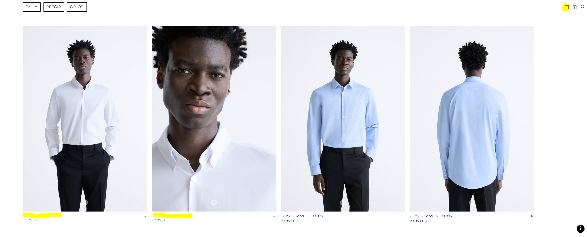
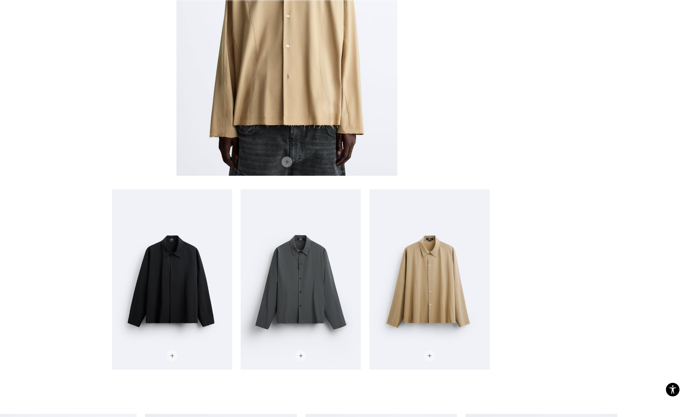
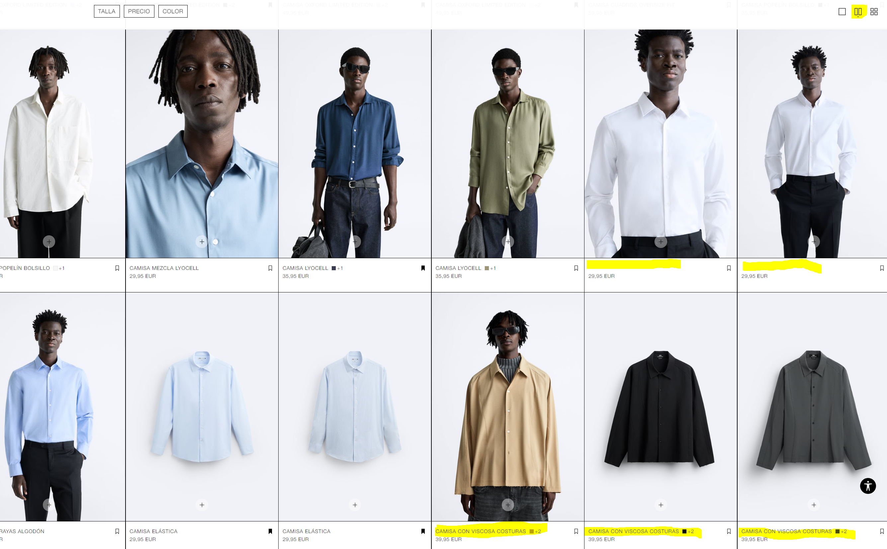
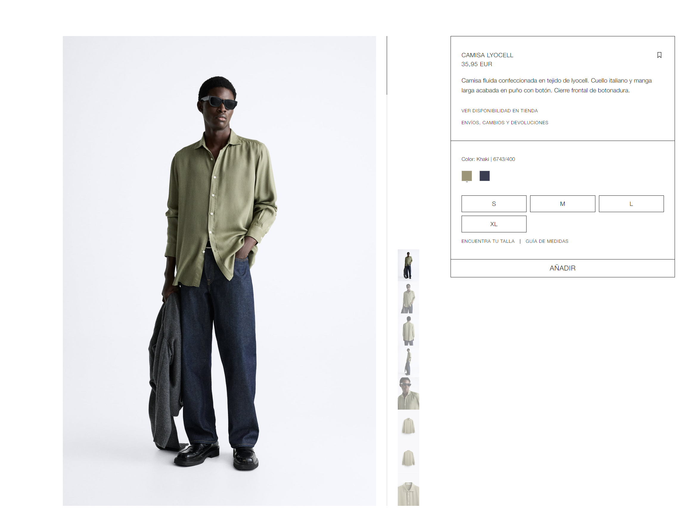
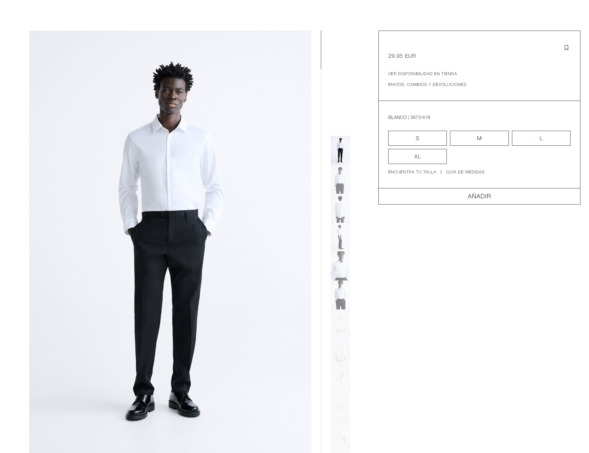
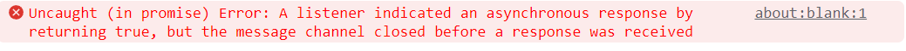

El bug a comentar es el siguiente:

En la página principal de Zara: https://www.zara.com/es/ca/

Nos dirigimos al apartado de camisas de hombre:

    https://www.zara.com/es/es/hombre-camisas-l737.html?v1=2297813

Una vez aquí haciendo scroll vemos como todas las camisas tienen nombre y precio a excepción de dos camisas blancas que solo tienen precio, estando en la vista por defecto:

y otras sin descripción completamente:

Si cambiamos de vista 

arriba a la derecha hemos seleccionado la segunda vista del closet, vemos como el caso de las camisas sin descripción se soluciona y aparece su descripción con el precio pero en el caso de las camisas sin nombre no aparece.

Entramos al detalle de una camisa cualquiera

y lo comparamos con la camisa blanca 

y efectivamente comprobamos que es un fallo del producto como también vemos en la consola de desarrollador

TO DO: Arreglar los productos para que muestren correctamente su nombre como en las demás prendas.

Prioridad: Media, si bien no afecta a la compra de las camisas ni a su funcionamiento, es una experiencia directa de la compra y no permite buscar el producto desde un buscador.

Impacto: Bajo/Medio, si bien no es un funcionamiento importante, si escalase a más productos no podrían buscarse y eso podría generar un impacto en las ventas.

Probabilidad ocurrencia: Siempre.